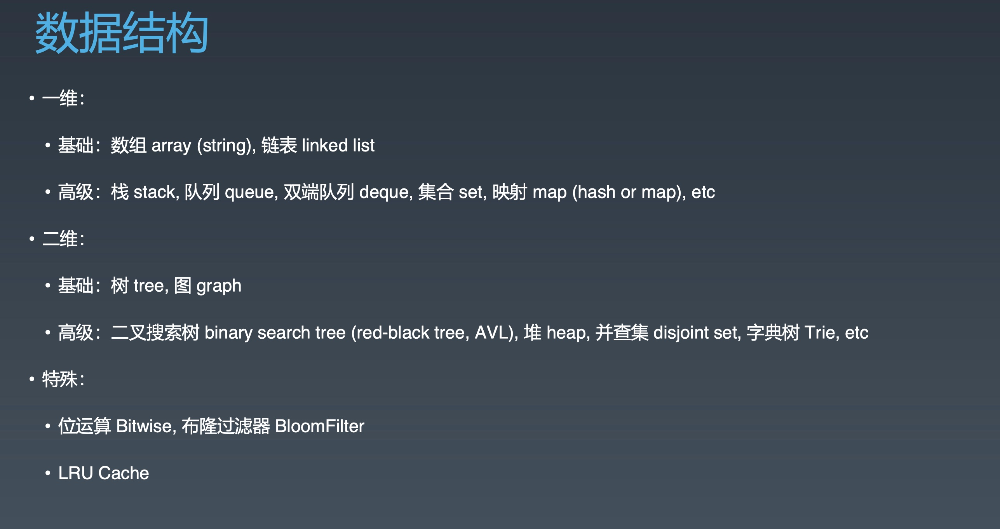
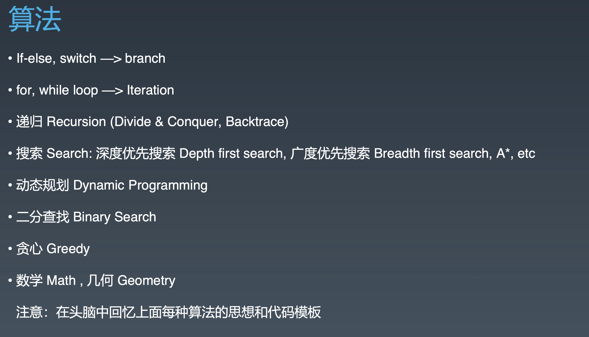
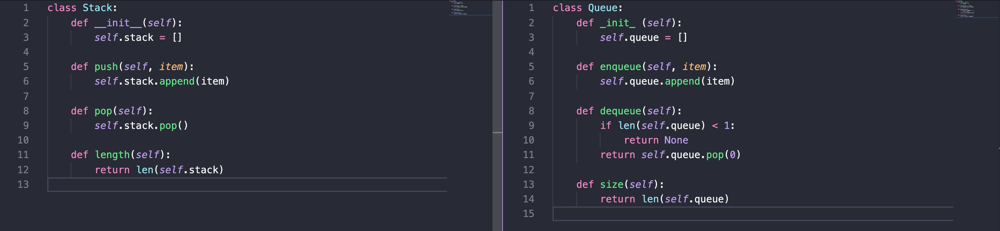

# Week01，学习笔记

## 如何高效学习算法训练营课程

### 1. 看视频

1.5~2倍速播放，难点（暂停+反复）

### 2. 学习方法

1. 改变自己的学习习惯（不要死磕）
2. 五毒神掌（重要的是 五！过遍数，而不是每次都花很长时间）
3. 做完题以后要看LeetCode上**中文版**和**国际版**上的高票代码

<strong>最大误区：LeetCode上的题只做一遍！</strong>

### 5. 五步刷题法（五毒神掌）

1. 刷题第一遍  

- 5分钟：读题+思考
- 直接看解法：注意！多解法，比较解法优劣
- 背诵、默写好的解法

2. 刷题第二遍  

- 马上自己写，然后LeetCode提交
- 多种解法比较、体会，然后进行优化

3. 刷题第三遍  

- 过了一天后，再重复做题
- 根据自己对不同解法的熟练程度做**专项练习**

4. 刷题第四遍  

- 过了一周：反复回来练习做过的题目

5. 刷题第五遍  

- 面试前一周：恢复性训练，做自己之前做过的题目

### 6. 职业训练

1. 拆分知识点（分解数据结构与算法）  

- 分解数据结构  

- 分解算法  

2. 刻意练习  
多练习自己薄弱的地方
3. 反馈  

看一些优秀的代码，或者把自己的代码给高手看

 

-----------------------------------------

 

## 数组、链表、跳表的基本实现和特性

### 1. 数组（Array）

1. 时间复杂度： 

- 查询：O(1)
- 插入：O(n)
- 删除：O(n)

2. 空间复杂度  

O(1)

### 2. 链表（Linked List、Double Linked List）

1. 时间复杂度

- prepend: O(1)
- append: O(1)
- lookup: O(n)
- insert: O(1)
- delete: O(1)

2. 空间复杂度  
O(1)

### 3. 跳表（Skip List）
<strong>注意：只能用于元素有序的情况。</strong>

<strong>升维思想 + 空间换时间</strong>

1. 时间复杂度  
插入、删除、搜索：O(logn)

2. 空间复杂度  
O(n)

 

---------------------------------

 

## 栈、队列、双端队列、优先队列
<strong>以下的大O表示法，均是指时间复杂度</strong>

### 1. 栈 和 队列（Stack & Queue）

1. Stack：先入后出；添加、删除皆为 O(1)
2. Queue：先入先出；添加、删除皆为 O(1)

### 2. 双端队列（Deque）

1. 简单理解：两端可以进出的 Queue  
Deque - double ended queue

2. 插入和删除皆为 O(1)

### 3. Stack 和 Queue 的实现

### 4. 优先队列

1. 插入操作：O(1)

2. 取出操作：O(logN) - 按照元素的优先级取出

3. 底层具体实现的数据结构较为多样和复杂：heap、bst、treap
